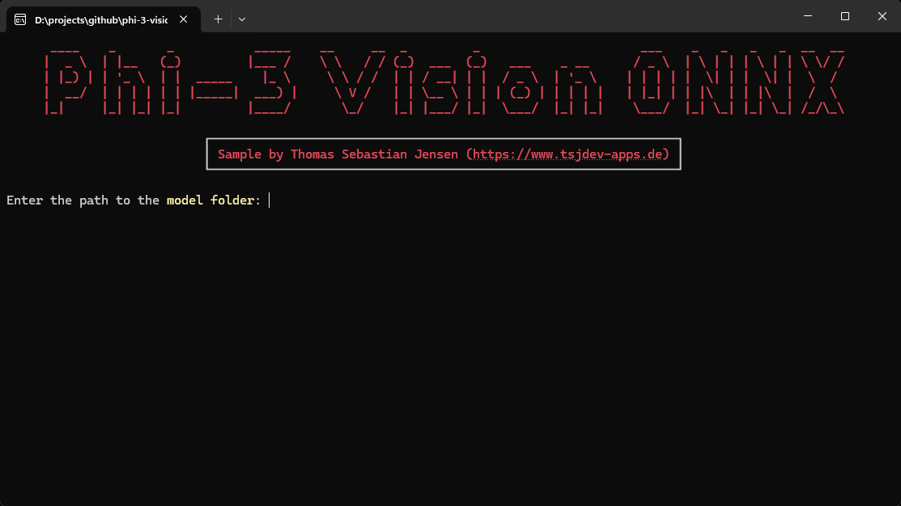
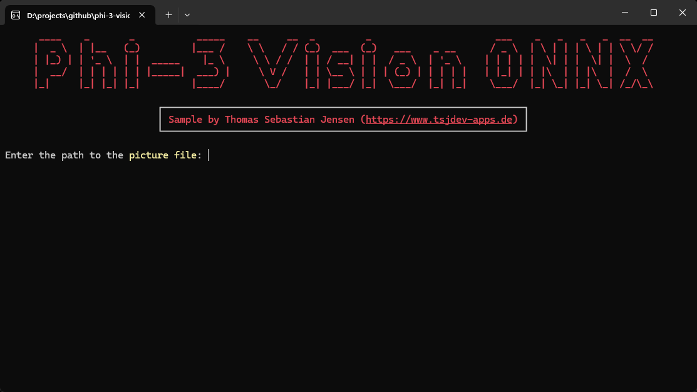
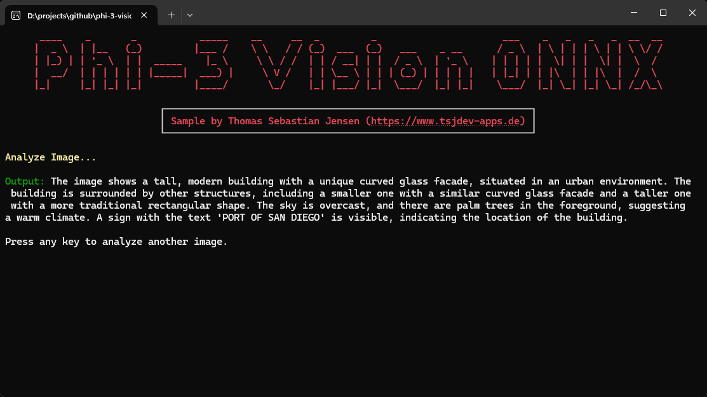

# Using Phi-3 Vision with ONNX as local Small Language Model to analyze images


This repository demonstrates how to seamlessly integrate the Phi-3 Vision Model using ONNX in a .NET Console application. By following this guide, you will learn how to set up and use a local Small Language Model to analyze and work with images.

## Getting Started

Make sure that Git LFS (Large File Storage) is installed by running the following command:

```bash
git lfs install
```

Now, we can clone the model from [Hugging Face](https://huggingface.co/microsoft/Phi-3-vision-128k-instruct).

```bash
git clone https://huggingface.co/microsoft/Phi-3-vision-128k-instruct
```

In the downloaded folder, you will find a directory named `cpu-int4-rtn-block-32-acc-level-4`. This directory contains all the necessary files. Be sure to note the path to this folder.

Now, let's run the application.

## Screenshots

First, you need to specify the path to the model folder.



Next, you need to specify the path to the image.



As a demo case I’m using the following image.


The following screenshot shows the image description using the local ONNX model.



## Blog Post

If you are more interested into details, please see the following post on [medium.com](https://www.medium.com):

- [Using Phi-3 Vision with ONNX as local Small Language Model to analyze images](https://medium.com/medialesson/using-phi-3-vision-with-onnx-as-local-small-language-model-to-analyze-images-a49573dc36a2)